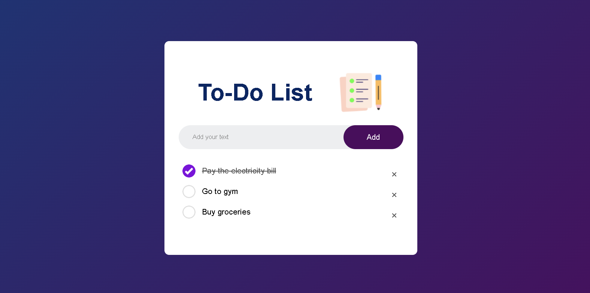

<h1 align="center">To-Do List Web App</h1>
This is a simple yet functional To-Do List web application built using HTML, CSS, and JavaScript. The app allows users to add, remove, and mark tasks as completed. One of the key features is that the to-do list persists even after refreshing the page, thanks to the use of localStorage for storing the tasks.
<br>

<h3>Features</h3>
<ul>
  <li>Add Tasks: Easily add new tasks to your to-do list.</li>
  <li>Remove Tasks: Delete tasks that are no longer needed.</li>
  <li>Mark as Completed: Tick off tasks that you have completed.</li>
  <li>Persistent Storage: Your tasks are saved in localStorage, so they remain even after refreshing the page.</li>
</ul>

<h3>Screenshot</h3>



<br>
<h3>Getting Started</h3>
To get a local copy up and running, follow these simple steps: <br>

1. **Clone the repository**:
   ```sh
   git clone https://github.com/abhiishekpanchal/TO-DO-LIST-APP.git
   
2. **Open the project**:
Navigate to the project directory and open index.html in your web browser.
